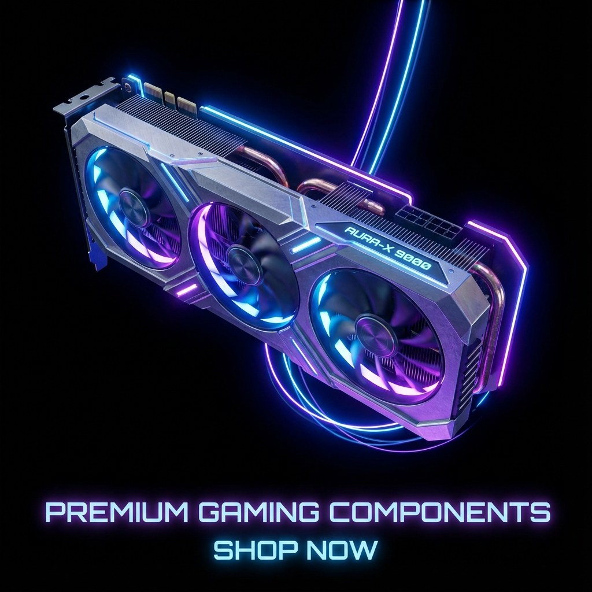
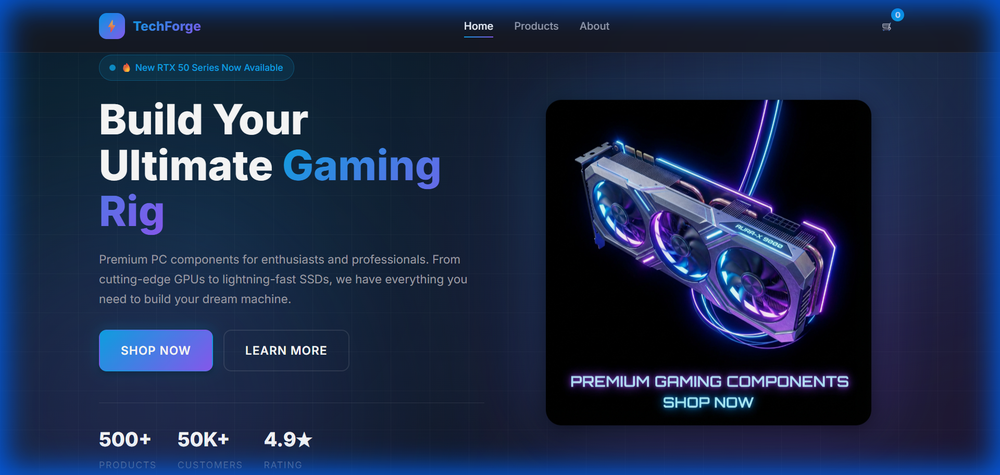
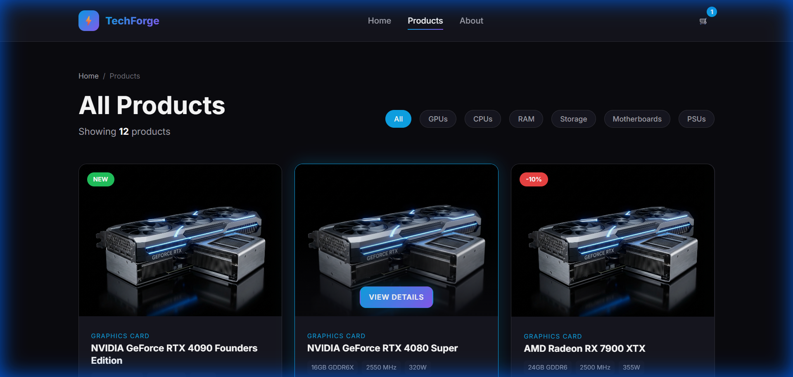
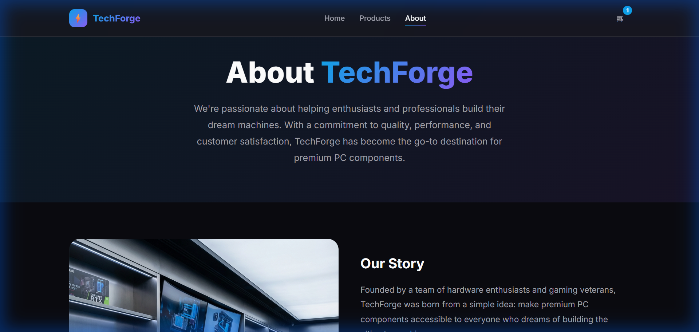

# PC Parts Store Premium Demo

<div align="center">



**A premium frontend-only showcase website for a PC Parts E-Commerce Store**

[](https://developer.mozilla.org/en-US/docs/Web/HTML)
[](https://developer.mozilla.org/en-US/docs/Web/CSS)
[](https://developer.mozilla.org/en-US/docs/Web/JavaScript)

[Live Demo](#) • [Features](#-features) • [Screenshots](#-screenshots) • [Getting Started](#-getting-started)

</div>

---

## 📸 Screenshots

### Home Page


### Products Page


### About Page


---

## ✨ Features

- 🎨 **Premium Dark Theme** - Sleek black/dark gray design with blue accents
- 📱 **Fully Responsive** - Optimized for desktop, tablet, and mobile devices
- ⚡ **Modern UI/UX** - Smooth hover effects, animations, and professional typography
- 🛒 **Interactive Cart** - Add/remove items with localStorage persistence
- 🔍 **Product Filtering** - Filter by category on products page
- 🔔 **Toast Notifications** - User feedback on actions

---

## 📄 Pages

| Page | Description |
|------|-------------|
| `index.html` | Home page with hero section, featured categories, and products |
| `products.html` | Complete product catalog with category filtering |
| `product.html` | Detailed product view with specifications |
| `about.html` | Store concept and company information |

---

## 🛠 Tech Stack

- **HTML5** - Semantic, accessible markup
- **CSS3** - Modern layouts with Flexbox and Grid
- **Vanilla JavaScript** - Interactive functionality without frameworks
- **No Backend** - Pure frontend demonstration

---

## 📂 Project Structure

```
pc-parts-store-premium-demo/
├── index.html          # Home page
├── products.html       # Products catalog
├── product.html        # Product details
├── about.html          # About page
├── css/
│   └── style.css       # Main stylesheet
├── js/
│   └── main.js         # JavaScript functionality
├── assets/
│   └── images/         # Product and UI images
└── README.md
```

---

## 🚀 Getting Started

1. **Clone the repository**
```bash
git clone https://github.com/mohammad-emad9/PC-Parts-Store-Premium-Demo.git
```

2. **Navigate to the project**
```bash
cd PC-Parts-Store-Premium-Demo
```

3. **Open in browser**
```bash
# Windows
start index.html

# macOS
open index.html

# Linux
xdg-open index.html
```

Or use a live server extension in VS Code for the best experience.

---

## 💻 Browser Support

| Browser | Support |
|---------|---------|
| Chrome | ✅ |
| Firefox | ✅ |
| Safari | ✅ |
| Edge | ✅ |

---

## 📱 Responsive Breakpoints

| Device | Width |
|--------|-------|
| Mobile | < 768px |
| Tablet | 768px - 1024px |
| Desktop | > 1024px |

---

## 🎯 Use Cases

- ✅ Portfolio demonstration
- ✅ Client presentation
- ✅ UI/UX concept showcase
- ✅ Frontend development template

---

## 📝 License

This project is open source and available for personal and commercial use.

---

<div align="center">

**Built with ❤️ for PC enthusiasts**

</div>
